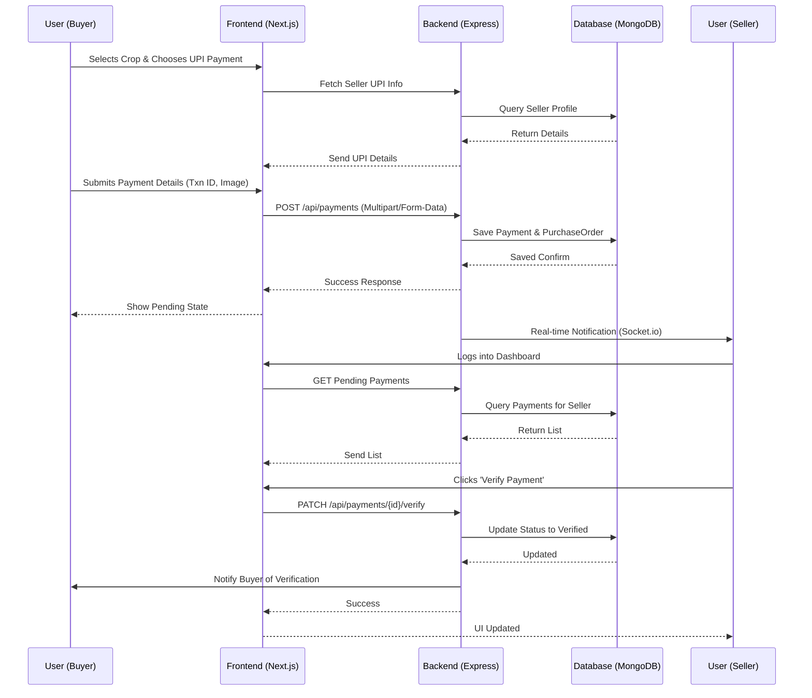

# Community Garden & Crop Sharing Platform (GardenShare)
## Complete Project Architecture Report

### 1. Project Overview and Purpose
**GardenShare** is a full-stack community garden and crop sharing platform designed to connect community members. Its primary purpose is to allow users to collaboratively grow, share, and exchange crops. It bridges the gap between local growers and consumers, providing tools for garden management, crop listing, community feeds, interactive mapping, direct messaging, and secure online payments.

### 2. Frontend Technology, Folder Structure, and UI Flow
**Technologies**: Next.js 14, React 18, TypeScript, Tailwind CSS, Lucide React (icons), React Hook Form, and React Hot Toast.

**Folder Structure (`/client`)**:
- `/app`: Contains Next.js App Router pages (e.g., `/buyer/payment-history`, `/seller/payment-verification`, `/crops/[id]`).
- `/components`: Reusable UI components (`PaymentModal`, `PaymentForm`, etc.).
- `/public`: Static assets like images and icons.

**UI Flow**:
1. **Onboarding**: User Registers/Logs in.
2. **Discovery**: User explores the platform via a List View or Interactive Map to find nearby gardens/crops.
3. **Action**: User views crop details and initiates a purchase request.
4. **Checkout**: User selects "Online Payment" (UPI) or Cash on Delivery.
5. **Dashboard**: Users manage their activities (Sellers verify payments, Buyers track orders).

### 3. Backend Technology, Architecture, Packages, and API Flow
**Technologies**: Node.js, Express.js (Primary Backend). *Note: There is an experimental/alternative backend setup in `server-spring` using Java Spring Boot.*
**Architecture**: MVC (Model-View-Controller) based RESTful API.
**Packages**: Express, Mongoose, JsonWebToken (JWT), Multer, Cloudinary, Socket.io, Express-Validator, Bcryptjs.

**API Flow**:
1. Request hits the Express router (e.g., `/api/payments`).
2. Middleware executes (JWT verification, role validation).
3. Request body is validated using `express-validator`.
4. The Route Controller processes the business logic.
5. The Controller interacts with MongoDB via Mongoose Models.
6. A JSON response is returned to the client.

### 4. Database Used and Backend
- **Database**: MongoDB (can be hosted on MongoDB Atlas or run locally).
- **ODM**: Mongoose 8.0.3 is used to define schemas and interact with the database securely.
- **Backend Environment**: The primary backend runs on Node.js utilizing Express.js.

### 5. Authentication and Authorization Process
- **Authentication**: Implemented using JSON Web Tokens (JWT). When a user logs in, the server hashes the password using `bcryptjs` and compares it. On success, a JWT is generated and sent to the client.
- **Authorization**: The JWT is sent in the `Authorization` header (`Bearer <token>`) for protected routes. Backend middleware extracts the token, verifies it, and attaches the `userId` and `role` to the request object. Certain routes check the role (e.g., Seller vs Buyer) before granting access.

### 6. Payment Integration and Complete Payment Flow
**Integration**: A custom manual online payment system using UPI.
**Payment Flow**:
1. **Creation**: Buyer selects "Online Payment" and views the Seller's UPI details via the `PaymentModal`.
2. **Transaction**: Buyer makes the payment on their UPI App (GPay, PhonePe, etc.).
3. **Submission**: Buyer submits the Transaction ID, Date, App Name, and an optional screenshot.
4. **Backend Processing**: Server creates a `Payment` and a `PurchaseOrder` document, setting the status to "Pending Verification".
5. **Verification**: Seller accesses their Payment Verification dashboard, views the transaction ID and screenshot, and clicks "Verify".
6. **Completion**: The payment status is marked as "Verified" and the order is "Confirmed", triggering a notification to the buyer.

### 7. Maps/Location Integration and How Seller Locations are Handled
- **Integration**: Map functionality is built using `Leaflet` and `react-leaflet` on the frontend.
- **Location Handling**: When a seller creates a garden or updates their profile, their exact coordinates (Latitude and Longitude) are captured and saved in the MongoDB database. 
- **Display**: The frontend fetches these coordinates and renders interactive map markers, allowing buyers to visually locate nearby crops and community gardens.

### 8. File Upload/Storage Process
1. **Frontend**: The user selects an image (e.g., payment screenshot, crop photo) using an HTML input or `react-dropzone`. The file is appended to a `FormData` object and sent via POST request.
2. **Backend**: Express uses the `multer` middleware to parse the multipart/form-data.
3. **Storage**: The file buffer/path is uploaded to **Cloudinary** (a cloud-based image/video management service) using their API.
4. **Database**: Cloudinary returns a secure URL (HTTPS), which is then saved as a string in the MongoDB document (e.g., `payment.screenshot` or `crop.imageUrl`).

### 9. Environment Variables and Configuration Files
**Backend (`server/.env`)**:
- `MONGODB_URI`: Connection string for MongoDB.
- `JWT_SECRET`: Secret key for signing tokens.
- `PORT`: Server port (default 5000).
- `CLOUDINARY_*`: API credentials for image storage.
- `OPENAI_API_KEY`: Key for AI crop identification features.

**Frontend (`client/.env.local`)**:
- `NEXT_PUBLIC_API_URL`: URL pointing to the Node.js backend.
- `NEXT_PUBLIC_MAP_API_KEY`: API key for map rendering (if required by map provider).

### 10. Complete Request Flow (Example: Verifying a Payment)
1. **User Action**: Seller clicks the "Verify" button on a pending payment.
2. **Frontend**: Next.js triggers an `axios.patch('/api/payments/123/verify')` request, attaching the JWT token in headers.
3. **Backend Middleware**: Express `auth` middleware intercepts, verifies the JWT, and extracts the user ID.
4. **Backend Controller**: The `verifyPayment` function executes. It checks if the payment exists and if the requester is the authorized seller.
5. **Database**: Mongoose updates the `Payment` document status to "Verified" and the associated `PurchaseOrder` to "Confirmed".
6. **Response**: Express sends a `200 OK` JSON response back. Socket.io may emit a real-time notification to the buyer.
7. **Frontend State**: Next.js updates the UI state, moving the payment to the "Verified" tab, and shows a success Toast notification.

### 11. Project Folder Structure
```
GardenShare/
├── client/                     # Next.js Frontend Application
│   ├── app/                    # App router pages (buyer, seller, crops)
│   ├── components/             # Reusable UI components (PaymentForm, PaymentModal)
│   └── public/                 # Static assets
├── server/                     # Express.js Backend Application
│   ├── models/                 # Mongoose schemas (Payment.js, PurchaseOrder.js)
│   ├── routes/                 # API route definitions and controllers
│   └── index.js                # Main server entry point
├── server-spring/              # Alternative Java Spring Boot Backend (Experimental)
├── docs/                       # Project Documentation
├── IMPLEMENTATION_SUMMARY.md   # Summary of implemented features
├── DEPLOYMENT.md               # Deployment guides
└── README.md                   # This project architecture report
```

### 12. Technologies, Frameworks, Libraries, and Dependencies
- **Frontend Stack**: React 18, Next.js 14, TypeScript 5.3, Tailwind CSS 3.3.
- **Frontend Libraries**: Axios (HTTP), React Hook Form (forms), React Hot Toast (notifications), Leaflet & React-Leaflet (maps), Framer Motion (animations), Lucide React (icons), Firebase.
- **Backend Stack**: Node.js, Express.js 4.18.
- **Backend Libraries**: Mongoose 8.0, JsonWebToken, Bcryptjs, Cloudinary, Multer, Express-Validator, Socket.io 4.7, Nodemailer, OpenAI (AI capabilities).
- **DevTools**: Nodemon, Jest, Supertest.

### 13. Deployment Process
- **Frontend**: Deployed seamlessly on **Vercel**. Code pushed to GitHub automatically triggers a Next.js build. Environment variables (`NEXT_PUBLIC_API_URL`) are configured in the Vercel dashboard.
- **Backend**: Deployed on Platforms like **Railway**, **Render**, or **DigitalOcean**. Can also be containerized using Docker (Dockerfile provided). The MongoDB connection string and API keys are set in the cloud provider's environment variables.
- **Database**: Hosted on **MongoDB Atlas** for scalable, cloud-based data storage.

### 14. Overall Workflow Step-by-Step Flowchart



### 15. Missing Features, Bugs, and Improvements
**Improvements & Future Features:**
1. **Dynamic UPI QR Code Generation**: Currently, a placeholder/static QR is used. Integrating a dynamic QR generator based on the total amount and seller's UPI ID would improve user experience.
2. **Automated Payment Gateways**: Integrating Razorpay or Stripe for automated real-time payment verification without requiring manual seller approval.
3. **Refund & Dispute Management**: A system to handle disputes if a seller rejects a valid payment or if crops are undelivered.
4. **Pagination and Performance**: Add pagination to the payment history and seller dashboards as the user base scales.
5. **Image Compression**: Client-side image compression before uploading screenshots to Cloudinary to save bandwidth and storage.
6. **Push Notifications**: Integrating Firebase Cloud Messaging (FCM) for mobile-friendly push notifications instead of relying solely on Socket.io and Email.
